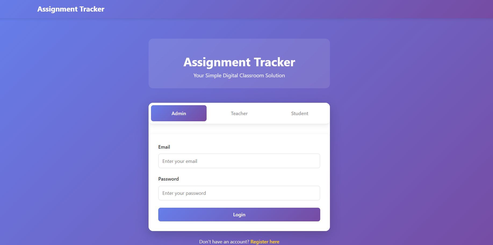
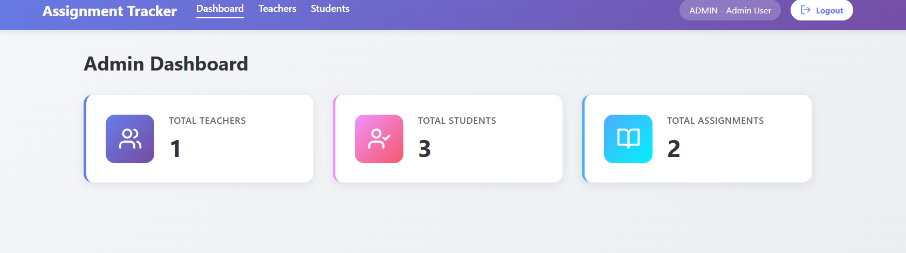
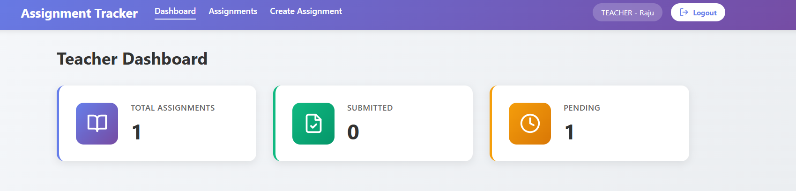
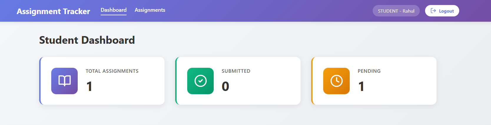
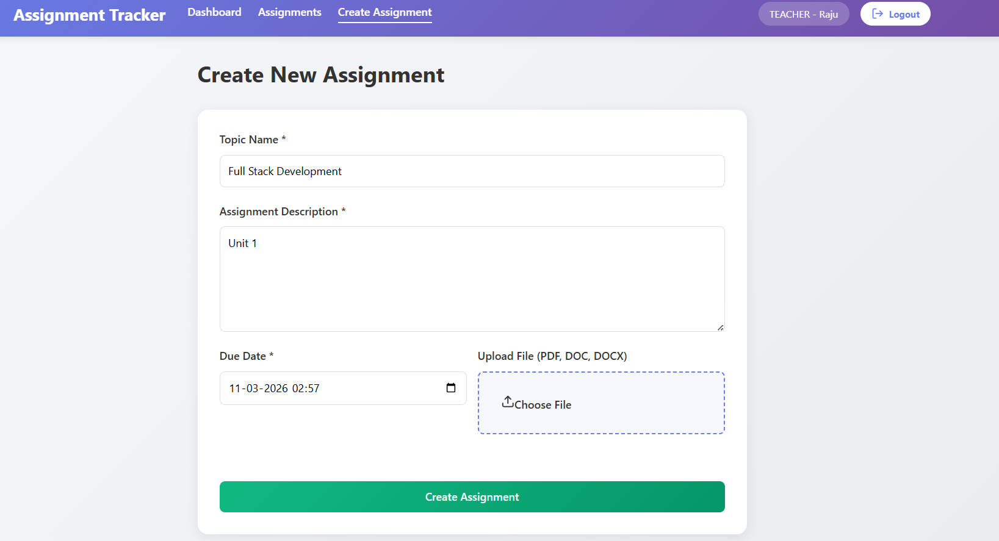

# Student Assignment Tracker

## Overview

Student Assignment Tracker is a web-based application designed to manage assignments in an educational environment. It supports three types of users: administrators, teachers, and students.

The system allows administrators to manage users, teachers to create and monitor assignments, and students to view and submit their work. The goal is to simplify assignment handling and improve coordination between teachers and students.

---

## Features


* Role-based access (Admin, Teacher, Student)
* User management for teachers and students
* Assignment creation with file upload support
* Assignment submission by students
* Submission tracking for teachers
* Grading system for evaluating student submissions
* Input validation and basic error handling
* Separate dashboards for each user role

---

## Tech Stack

### Backend

* Node.js
* Express.js
* MySQL
* bcrypt (password hashing)
* multer (file uploads)
* express-session (session management)
* cors

### Frontend

* React
* React Router DOM
* Axios

### Database

* MySQL

---

## Project Structure

```
student-assignment-tracker/
├── backend/
│   ├── config/         # Database configuration
│   ├── controllers/    # Business logic
│   ├── middleware/     # Authentication and authorization
│   ├── routes/         # API routes
│   ├── uploads/        # Assignment and submission files
│   └── server.js       # Entry point
│
├── frontend/
│   ├── public/         # Static files
│   └── src/
│       ├── components/ # Reusable UI components
│       ├── pages/      # Application pages
│       └── App.js      # Main app file
│
└── database/
    ├── setup.sql
    └── migrations/
```

---

## Setup Instructions

### Prerequisites

* Node.js (v14 or higher)
* MySQL

### Installation

1. Clone the repository

2. Install backend dependencies:
   cd backend
   npm install

3. Install frontend dependencies:
   cd frontend
   npm install

---

## Configuration

Update database credentials in the backend configuration file (e.g., `config/db.js`):

```
host: "localhost"
user: "root"
password: "yourpassword"
database: "student_assignment_tracker"
```

---

## Database Setup

1. Create a MySQL database
2. Run the `setup.sql` script to initialize tables
3. Run migration files (if required) for additional features

---

## Running the Application

Start backend:

```
cd backend
npm start
```

Start frontend:

```
cd frontend
npm start
```

Application runs at:
http://localhost:3000

---

## Usage

* Admin logs in and creates teacher and student accounts
* Teachers create assignments and view submissions
* Students view assignments and submit their work

Each user is redirected to their respective dashboard after login.

---

## API Overview

### Authentication

* POST /api/auth/login
* POST /api/auth/register
* GET /api/auth/logout

### Admin

* GET /api/admin/dashboard
* GET /api/admin/teachers
* GET /api/admin/students
* POST /api/admin/add-teacher
* POST /api/admin/add-student

### Teacher

* GET /api/teacher/assignments
* POST /api/teacher/create-assignment

### Student

* GET /api/student/assignments
* POST /api/student/submit-assignment

---

## Screenshots

### Login


### Admin Dashboard


### Teacher Dashboard


### Student Dashboard


### Creating New Assignments Tab


---

## Future Improvements

## Future Improvements

* Improve UI and responsiveness
* Add email or notification system for deadlines
* Enhance filtering and search for assignments
* Optimize file upload handling and storage
* Add role-based analytics and reports

---

## Author

Developed as part of MCA coursework and personal project practice.
